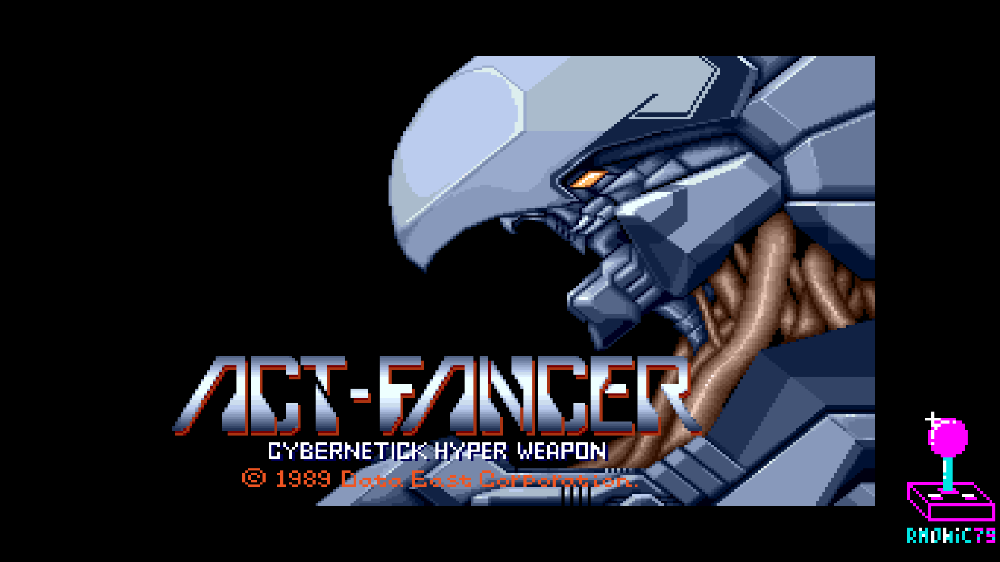
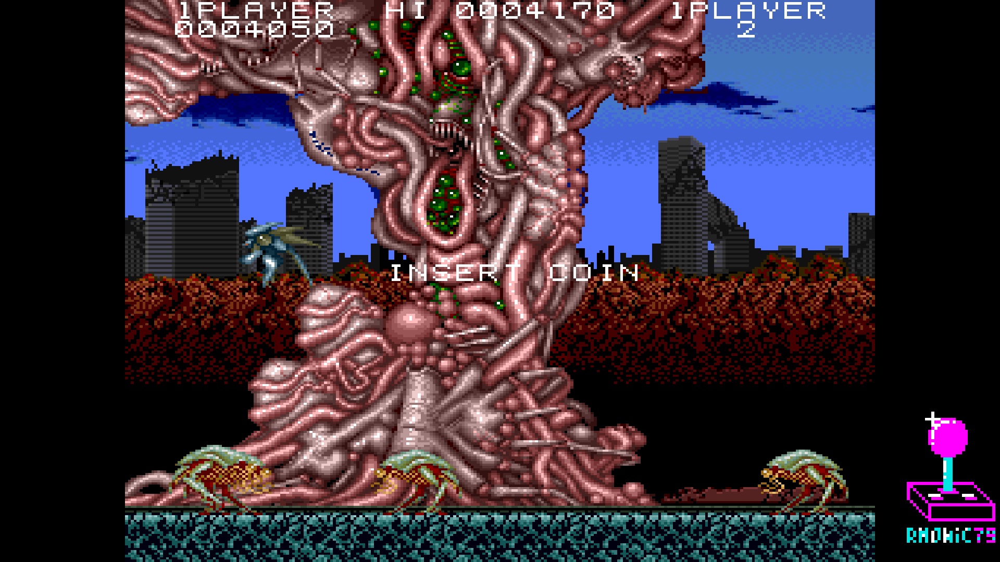
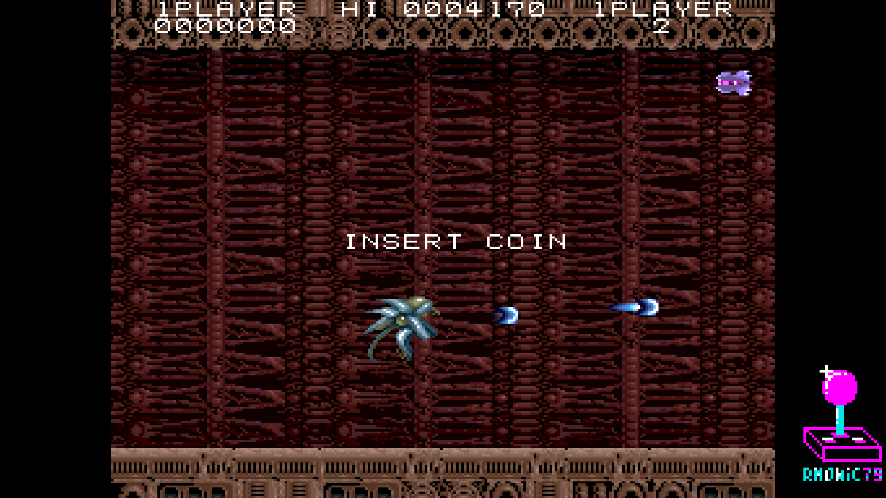
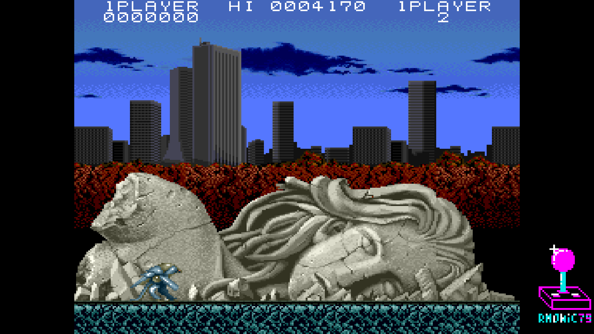

# Arcade-ActFancer_MiSTer

FPGA core for **Act-Fancer Cybernetick Hyper Weapon** (Data East, 1989)
targeting the [MiSTer FPGA](https://github.com/MiSTer-devel) platform
(Terasic DE10-Nano).

Act-Fancer is a **side-scrolling action platformer** running on
**Data East DEC0 hardware**.

## Status

**Current version: 1.0** (June 2026).

The core runs the full game with audio and inputs.

**Features**
- HuC6280 main CPU @ 7.159 MHz (HUC6280 VHDL core)
- M6502 sound CPU @ 1.5 MHz (T65 VHDL core)
- YM2203 OPN + YM3812 OPL2 + OKI M6295 ADPCM, MAME-accurate clocks
- 256×240 active video area, 57.45 Hz refresh (hardware-accurate)
- 2 BAC06 tile layers (PF0 16×16 background + PF1 8×8 characters) via Jotego's `jtcop_bac06`
- MXC06 sprite chip (16×16, palette-banking, priority)
- Per-channel audio mixer in OSD (YM2203 / YM3812 / OKI ADPCM gain, 7-bit Q4.4)
- **Analog VGA H-Shift / V-Shift / H-Size** OSD options for fine alignment on 15 kHz CRTs
- Pause overlay with logo + supporters scroll
- Hardware-accurate DIP switches: Coinage, Demo Sounds, Flip Screen,
  Cabinet, Lives, Difficulty, Bonus Life

**ROM sets supported**
- Act-Fancer (`actfancr`, World rev 3)
- Act-Fancer (`actfancr1`, World rev 1)
- Act-Fancer (`actfancr2`, World rev 2)
- Act-Fancer (`actfancrj`, Japan rev 1)

## Screenshots

| | |
|---|---|
|  |  |
| Title screen | Hero intro |
|  |  |
| Attract mode — city | Attract mode — corridor |
|  | |
| Stage 1 — ruined city | |

## Hardware emulated

| Component        | Spec                                                |
|------------------|-----------------------------------------------------|
| Master clock     | 21.477 MHz crystal (main CPU XIN)                   |
| Main CPU         | HuC6280 @ 7.159 MHz (21.477 / 3)                    |
| Sound CPU        | M6502 @ 1.5 MHz                                     |
| Sound chip 1     | Yamaha YM2203 (OPN) @ 1.5 MHz (jt03)                |
| Sound chip 2     | Yamaha YM3812 (OPL2) @ 3.0 MHz (jtopl2)             |
| Sound chip 3     | OKI M6295 (jt6295) @ 1.056 MHz, pin7=HIGH           |
| Video resolution | 256×240 active                                      |
| Pixel clock      | 6.000 MHz (96 MHz / 16)                             |
| HTotal / VTotal  | 384 / 272                                           |
| Refresh rate     | 57.45 Hz (6 MHz / 384 / 272, hardware-accurate)     |
| PF0 (BG)         | 16×16 4bpp tile layer (BAC06)                       |
| PF1 (FG / chars) | 8×8 4bpp tile layer (BAC06)                         |
| Sprites          | 16×16 4bpp, MXC06 sprite chip                       |
| Palette          | xBGR_555, 1024 entries                              |
| Tile / sprite IC | DECO BAC06 (×2) + MXC06                             |

## Analog VGA H-Size (analog_hsize)

The core includes a custom **Analog VGA horizontal pixel-stretch** module
(`sys/analog_hsize.sv`) authored by the core developer and originally
released as a standalone reusable module:

- Repository: [MiSTer-AnalogHStretch](https://github.com/rmonic79/MiSTer-AnalogHStretch)

What it does on the analog VGA branch only (HDMI is NOT touched):
- Each source pixel is emitted to the DAC for the same **integer-uniform**
  number of pixel-clock periods. Identical stretch factor on every pixel of
  every line ⇒ no shimmering, no blending/blur, no duplicated pixels.
- The slight reduction in analog horizontal sync rate is absorbed by the
  porches, well within the tolerance of 15 kHz CRTs / PVMs.

Controlled by the `Analog VGA H-Size` OSD entry (0 = bypass, +1..+7 =
progressively wider analog viewport).

## Hardware requirements

- Terasic DE10-Nano
- MiSTer I/O board (recommended)
- Works on HDMI displays and on 15 kHz CRTs via the analog video output

## Building from source

Requires Quartus Prime 17.0 (free Lite Edition).

```
Open ActFancer.qpf in Quartus → Processing → Start Compilation
```

Output bitstream is generated in `output_files/ActFancer.rbf` (~3.7 MB).

## Running on MiSTer

The [releases/](releases/) folder contains the parent MRA, regional
clones and a prebuilt RBF:

- `Act-Fancer (World rev 3).mra` — parent MRA
- `ActFancer_YYYYMMDD.rbf` — prebuilt bitstream
- `Act-Fancer (World rev 1).mra` / `(World rev 2).mra` / `(Japan rev 1).mra` — regional clones

Steps:

1. Copy the `.rbf` to `_Arcade/cores/` on the MiSTer SD card.
2. Copy the `.mra` file(s) to `_Arcade/` on the MiSTer SD card.
3. Provide your legally-owned `actfancr.zip` (or regional variant) where
   the MRA expects it (usually in `games/mame/`).

**ROMs are NOT included in this repository.** You must provide them yourself.

## Repository layout

```
Arcade-ActFancer_MiSTer/
├── rtl/
│   ├── actfancer/    Act-Fancer-specific core RTL
│   ├── HUC6280/      HuC6280 main CPU (VHDL)
│   ├── pll/          Clock PLL
│   ├── sound/        Sound chip cores (jt03, jtopl, jt6295, t65)
│   ├── common/       Shared utilities (BRAM ROMs, DDRAM bridge)
│   └── sdram.sv      SDRAM controller (Sorgelig)
├── sys/              MiSTer framework (Sorgelig / MiSTer-devel)
├── jtframe/          JTFRAME framework modules
├── logo/             Pause overlay assets (font, logo, supporter list)
├── releases/         Parent MRA + regional clones + prebuilt RBF
├── ActFancer.qpf     Quartus project
├── ActFancer.qsf     Quartus assignments
├── ActFancer.sv      Top-level wrapper
├── Template.sdc      Timing constraints
├── files.qip         HDL file list
├── build_id.v        Build version stamp
└── README.md         This file
```

## Acknowledgements

- **Jose Tejada** ([@jotego](https://github.com/jotego)) for JT03 (YM2203),
  JTOPL (YM3812), JT6295 (OKI M6295), `jtcop_bac06` (DECO tilemap) and
  the JTFRAME framework.
- **Daniel Wallner** for the T65 (6502) core.
- **Mike Johnson / Wolfgang Scherr** and others for the HUC6280 VHDL core.
- **Sorgelig** and the **MiSTer-devel team** for the framework, SDRAM
  controller and Template.

## Support this project

If you enjoy this core and want to support its development:

- [Ko-fi](https://ko-fi.com/ibecerivideoludici) — one-time support
- [Patreon](https://www.patreon.com/IBeceriVideoludici) — monthly support
- [PayPal](https://www.paypal.me/IBeceriVideoludici) — one-time donation

## Follow

- [GitHub](https://github.com/rmonic79)
- [Twitch](https://twitch.tv/ibecerivideoludici) — live streams
- [YouTube](https://www.youtube.com/c/IBeceriVideoludici) — playlists and videos
- [X / Twitter](https://x.com/rmonic79)

## License

The RTL source code in this repository is provided as-is for educational
and preservation purposes under **GNU GPL v3 or later**. Original ROM data
is not included; users must provide their own legally obtained copies.

Original *Act-Fancer Cybernetick Hyper Weapon* arcade hardware © Data East
Corporation, 1989.
